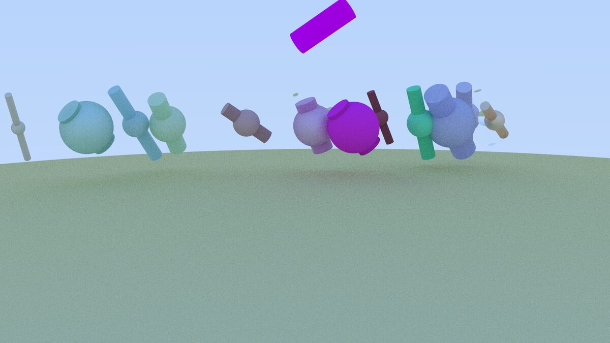

# Data Layout & Parallel Ray Tracer

[](https://github.com/Nikk888/parallel-raytracer-cpp/actions/workflows/ci.yml)

A C++23 CPU ray tracer for studying how data layout and task parallelism
affect a rendering workload. The project provides equivalent sequential
Array-of-Structs (AoS) and Struct-of-Arrays (SoA) implementations, plus a
deterministic oneTBB renderer that distributes image tiles across threads.



## What it demonstrates

- AoS and SoA image-buffer implementations behind the same rendering logic.
- Tile-based parallel rendering with `oneapi::tbb::parallel_for`.
- Configurable thread count, partitioner and 2D grain size.
- Deterministic per-pixel random streams independent of thread scheduling.
- BVH acceleration for spheres and finite cylinders.
- Matte, metallic and refractive materials.
- Anti-aliasing, recursive ray scattering and gamma correction.
- Unit, integration and layout-equivalence tests in GitHub Actions.
- A repeatable benchmark matrix with CSV output.

## Implementations

| Executable | Data layout | Execution |
|---|---|---|
| `render-aos` | `std::vector<Color>` | Sequential |
| `render-soa` | Separate red, green and blue arrays | Sequential |
| `render-par` | Separate red, green and blue arrays | oneTBB blocked 2D tasks |

The two sequential targets share the same camera, geometry, intersection and
shading code. CI renders the same seeded scene with both and requires their
PPM files to be byte-for-byte identical.

The parallel target creates independent random streams for each pixel. This
avoids RNG data races and makes a fixed scene reproducible across different
thread counts and TBB partitioners.

## Build and test

Requirements:

- CMake 3.25 or newer;
- a C++23 compiler;
- Ninja;
- oneTBB development files.

On Ubuntu:

```bash
sudo apt-get install build-essential cmake ninja-build libtbb-dev
cmake --preset release
cmake --build --preset release
ctest --preset release
```

The included development container installs the complete toolchain. A serial
build without oneTBB is also available:

```bash
cmake --preset serial-release
cmake --build --preset serial-release
```

## Run

Each executable takes a configuration file, a scene file and an output path:

```bash
out/build/release/aos/render-aos examples/config1.txt examples/scene1.txt aos.ppm
out/build/release/soa/render-soa examples/config1.txt examples/scene1.txt soa.ppm
out/build/release/par/render-par examples/config1.txt examples/scene1.txt parallel.ppm
```

The executables report render-only elapsed time as `TIME_MS=<value>`. Image
serialization is excluded from that measurement.

Parallel settings can be appended to any configuration:

```text
tbb_threads: 8
tbb_partitioner: static
tbb_grain_x: 16
tbb_grain_y: 4
```

`tbb_threads: 0` uses the oneTBB runtime default. Supported partitioners are
`simple`, `static` and `auto`.

## Benchmark

```bash
python3 scripts/benchmark.py \
  --build-dir out/build/release \
  --config examples/benchmark_config.txt \
  --scene examples/scene4.txt \
  --repeats 5 \
  --threads 1 2 4 8
```

Measurements are stored in `out/benchmarks/results.csv`. See
[the benchmarking notes](docs/benchmarking.md) for the methodology. The
manual `Benchmark` GitHub Actions workflow provides a repeatable hosted-runner
baseline.

### Hosted-runner baseline

Five repeats on the GitHub Actions Ubuntu runner produced these median render-only times:

| Variant | Threads | Median time | Speedup vs fastest sequential |
|---|---:|---:|---:|
| AoS sequential | 1 | 327 ms | 1.00x |
| SoA sequential | 1 | 331 ms | 0.99x |
| oneTBB parallel | 1 | 510 ms | 0.64x |
| oneTBB parallel | 2 | 289 ms | 1.13x |
| oneTBB parallel | 4 | 208 ms | **1.57x** |

The 4-thread version was the fastest configuration measured. The single-thread
parallel result also shows the runtime and task-management overhead, while the
2- and 4-thread results demonstrate useful scaling. Hosted runners are shared
infrastructure, so these figures are a reproducible baseline rather than a
hardware-independent performance claim. The raw CSV is attached to
[Benchmark run #1](https://github.com/Nikk888/parallel-raytracer-cpp/actions/runs/30286776259).

## Project provenance

This began as a 2025 Computer Architecture team project at Universidad Carlos
III de Madrid. I completed the majority of the implementation and maintain
this portfolio edition, which consolidates the sequential and parallel
deliveries while keeping the original university repositories unchanged.

The public documentation intentionally does not name the other students.
Source snapshots and the portfolio-specific corrections are recorded in
[the project history](docs/project-history.md) and [NOTICE](NOTICE).

## License

Licensed under the [Apache License 2.0](LICENSE).
